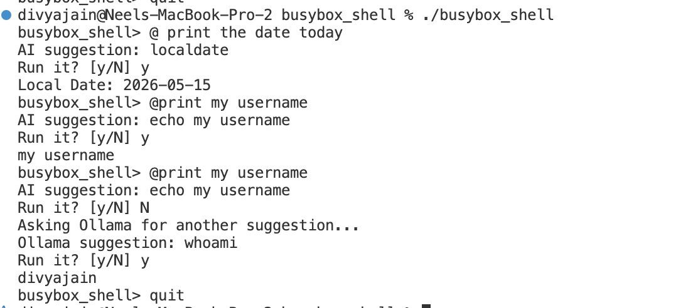

# BusyBox-Style Shell in C

This project implements a small BusyBox-inspired shell in C. One executable,
`busybox_shell`, contains many Unix-style commands and dispatches them through
a shared command registry.

Each command follows the same anatomy:

```c
int command_run(int argc, char **argv);
void command_print_usage(FILE *out);

cmd_spec_t cmd_command_spec = {
    .name = "...",
    .summary = "...",
    .long_help = "...",
    .run = command_run,
    .print_usage = command_print_usage,
};
```

## Build

```sh
make
```

Run a command directly:

```sh
./busybox_shell <command> [options]
```

Run the interactive shell:

```sh
./busybox_shell
```

Inside the shell:

```text
busybox_shell> help
busybox_shell> ls
busybox_shell> echo hello shell
busybox_shell> pkg
busybox_shell> exit
```

Interactive sessions support command history:

```text
Up arrow      recall older commands
Down arrow    move forward through recalled commands
Tab           complete command names or file paths
Left/Right    move the cursor while editing
Backspace     edit the current command
```

History is saved between sessions in:

```text
~/.busybox_shell_history
```

Tab completion uses command names for the first word and file/path names for
later words:

```text
busybox_shell> ec<Tab>        completes to echo
busybox_shell> cat READ<Tab>  completes to README.md when it is unique
busybox_shell> c<Tab>         shows matches such as cat, clear, and cp
```

## Natural-Language `@` Interface

Interactive input that starts with `@` is treated as a natural-language shell
request:

```text
busybox_shell> @ show today's date
AI suggestion: localdate
Run it? [y/N] y
Local Date: 2026-05-14
```

If a request is missing required information, the shell asks a follow-up
question before suggesting the command:

```text
busybox_shell> @ create a directory
Directory name: reports
AI suggestion: mkdir reports
Run it? [y/N] y
```

Example session:



The shell can connect to an external LLM helper through `MYSH_LLM_HELPER`.
The helper receives one prompt argument and should print exactly one
`busybox_shell` command:

```sh
MYSH_LLM_HELPER="./my_llm_helper.sh" ./busybox_shell
```

An Ollama helper is included. Install Ollama, pull a local model, then start
the shell with the helper:

```sh
ollama pull qwen2.5:3b
MYSH_LLM_HELPER="./ollama_llm_helper.sh" ./busybox_shell
```

To use a different local model:

```sh
OLLAMA_MODEL="mistral" MYSH_LLM_HELPER="./ollama_llm_helper.sh" ./busybox_shell
```

For faster second suggestions, use a smaller model or a shorter timeout:

```sh
OLLAMA_MODEL="qwen2.5:1.5b" OLLAMA_TIMEOUT=10 ./busybox_shell
```

If Ollama was installed locally in this repository, use:

```sh
cd busybox_shell
HOME="$PWD/../tools/ollama-home" \
OLLAMA_MODELS="$PWD/../tools/ollama-models" \
./busybox_shell
```

When the shell is started from the `busybox_shell` directory, it automatically
uses `./ollama_llm_helper.sh` if `MYSH_LLM_HELPER` is not set.

The shell validates the suggested command before running it. Only registered
commands and shell built-ins are accepted. In interactive mode, suggestions are
shown first and require confirmation. In non-interactive mode, suggestions are
shown but not executed.

The shell handles common requests with deterministic rules before calling the
LLM, then caches successful translations during the session. If you reject a
deterministic suggestion by answering `n`, the shell asks the configured Ollama
helper for another suggestion. The Ollama helper also reads
`./busybox_shell help --json` so its prompt uses the current command list
instead of a hardcoded list.

If no helper is configured, the shell uses a tiny demo fallback for common
requests such as listing files, creating directories, printing text, showing
the current directory, printing the date, showing command help, counting files,
showing file beginnings/endings, showing disk usage, showing the current user,
and showing system information.

### Training Data

The project includes a generator for fine-tuning examples. It reads the live
shell command list and help output, then writes prompt/completion pairs:

```sh
make
./generate_training_data.sh
```

The output is:

```text
training_data.jsonl
```

Example rows:

```json
{"prompt":"what does --json do in ls","completion":"ls -h --json","source":"option-help"}
{"prompt":"what is the version of ls","completion":"ls --version","source":"version"}
```

Regenerate this file whenever commands or options change.

For a LoRA fine-tuning workflow, see:

```text
training/README.md
```

## Commands

Built-in commands currently registered:

```text
ls          list directory contents
localdate   print the current local date
cat         concatenate and print files
pkg         manage shell packages
pwd         print the current working directory
wc          count lines, words, and bytes
touch       create files or update timestamps
mkdir       create directories
rmdir       remove empty directories
echo        print text to standard output
whoami      print the current username
clear       clear the terminal screen
id          print user and group identifiers
uname       print system information
head        print the first lines of files
tail        print the last lines of files
cp          copy files
mv          move or rename files
rm          remove files
dirname     print directory portion of paths
du          show disk usage
threads     run a POSIX threads demo
```

Every command supports help through either:

```sh
./busybox_shell <command> -h
./busybox_shell help <command>
```

Every registered command also supports version output:

```sh
./busybox_shell <command> --version
./busybox_shell <command> --version --json
```

Shell-level version output is available with:

```sh
./busybox_shell --version
./busybox_shell --version --json
```

Command help includes these shared features too:

```sh
./busybox_shell help ls
./busybox_shell ls -h
```

Both show the command-specific options plus a common options section for
`--version`, `--version --json`, and JSON help.

## Processes, Pipes, and Threads

This shell demonstrates two important operating-system ideas: process creation
and thread creation.

### Process

A process is a running program with its own memory space, file descriptors, and
execution state. In this project, the shell uses processes when running a
pipeline. Each command in the pipeline runs as a separate child process.

Example:

```sh
./busybox_shell echo alpha beta gamma "|" wc -w
```

What happens:

```text
parent shell
  |
  +-- child process 1: busybox_shell echo alpha beta gamma
  |
  +-- child process 2: busybox_shell wc -w
```

The output of the first process becomes the input of the second process:

```text
       3
```

### `fork()`

`fork()` creates a child process by copying the current process. After `fork()`,
both parent and child continue running. The parent keeps track of the child
process ID, while the child prepares to run the command.

In the pipeline implementation, `fork()` is used once for each command segment:

```text
echo alpha beta gamma | wc -w
         fork()          fork()
           |               |
        child 1         child 2
```

### `execvp()`

`execvp()` replaces the current child process program with another program. In
this project, each child process calls `execvp()` to re-run `busybox_shell` with
one command segment.

Conceptually:

```text
child process after fork()
  -> connect stdin/stdout with dup2()
  -> execvp("./busybox_shell", ["./busybox_shell", "wc", "-w"])
```

So the child starts as a copy of the shell, then becomes the command runner for
that pipeline stage.

### `pipe()` and `dup2()`

`pipe()` creates two file descriptors:

```text
pipefd[0] = read end
pipefd[1] = write end
```

`dup2()` connects those file descriptors to standard input or standard output.
For this command:

```sh
./busybox_shell cat Makefile "|" head -n 2
```

the shell connects the commands like this:

```text
cat stdout -> pipe write end
pipe read end -> head stdin
```

The result is:

```text
CC = gcc
CFLAGS = -Wall -Wextra -std=c11 -pthread
```

### Threads

A thread is a smaller unit of execution inside one process. Threads in the same
process share memory, so they are useful for doing multiple tasks concurrently
without starting separate programs.

This project includes a `threads` command that starts POSIX worker threads with
`pthread_create()`, waits for them with `pthread_join()`, and prints each
worker's result.

Example:

```sh
./busybox_shell threads -n 3
```

Output:

```text
started 3 threads
thread 1 result 1
thread 2 result 4
thread 3 result 9
```

JSON output is also available:

```sh
./busybox_shell threads --json -n 2
```

```json
{"threads":2,"results":[{"worker":1,"result":1},{"worker":2,"result":4}]}
```

### Quick Verification

After building, you can prove the binary uses process and thread APIs:

```sh
make
nm -u ./busybox_shell | grep -E 'fork|execvp|pipe|pthread'
```

Expected symbols include:

```text
_fork
_execvp
_pipe
_pthread_create
_pthread_join
```

## JSON Support

All built-in commands support `--json` output. Examples:

```sh
./busybox_shell ls --json
./busybox_shell pkg --json
./busybox_shell id --json
./busybox_shell uname --json
./busybox_shell wc --json README.md
./busybox_shell cat --json README.md
./busybox_shell head --json -n 5 README.md
./busybox_shell tail --json -n 5 README.md
./busybox_shell cp --json source.txt dest.txt
```

Data-oriented commands return their data as JSON fields. File-content commands
such as `cat`, `head`, and `tail` wrap escaped file contents in JSON. Commands
that mutate files, such as `cp`, `mv`, `rm`, `touch`, `mkdir`, and `rmdir`,
return a success/status object when `--json` is provided.

Help can also be returned as JSON:

```sh
./busybox_shell help --json
./busybox_shell help ls --json
./busybox_shell ls -h --json
```

`help --json` lists shell built-ins and registered commands. `help <command>
--json` and `<command> -h --json` return JSON metadata for a single command.

## Package Manager

The `pkg` command is both a built-in command and a tiny package manager for
installing extra external commands.

Supported subcommands:

```sh
./busybox_shell pkg build <src-dir> <output-tar>
./busybox_shell pkg install <tar-file>
./busybox_shell pkg list
./busybox_shell pkg remove <name>
```

Package files install under:

```text
~/.mysh/pkgs/<name>-<version>/
```

Executable symlinks are created under:

```text
~/.mysh/bin/
```

Installed packages are tracked in:

```text
~/.mysh/pkgdb.txt
```

## Minimal Package Format

A package is a `.tar.gz` archive containing at least:

```text
pkg.json
bin/<executable>
```

Example source directory:

```text
hello_pkg/
├── pkg.json
└── bin/
    └── hello
```

Example `pkg.json`:

```json
{
  "name": "hello",
  "version": "1.0.0",
  "description": "Tiny test command",
  "files": ["bin/hello"]
}
```

Example executable:

```sh
#!/bin/sh
echo "hello from package"
```

Build and install:

```sh
./busybox_shell pkg build hello_pkg hello-1.0.0.tar.gz
./busybox_shell pkg install hello-1.0.0.tar.gz
./busybox_shell pkg list
~/.mysh/bin/hello
./busybox_shell pkg remove hello
```

For safe testing, use a temporary home directory:

```sh
HOME="$PWD/test_home" ./busybox_shell pkg install hello-1.0.0.tar.gz
```

That keeps test installs under `./test_home/.mysh` instead of your real home
directory.

## Manual Test Examples

```sh
./busybox_shell localdate
./busybox_shell ls -a
./busybox_shell ls -l
./busybox_shell ls -R tmp
./busybox_shell ls -S
./busybox_shell ls -t
./busybox_shell ls -r
./busybox_shell ls --color
./busybox_shell cat README.md
./busybox_shell cat -n README.md
./busybox_shell cat -b README.md
./busybox_shell cat -s README.md
./busybox_shell cat -E README.md
./busybox_shell pwd
./busybox_shell pwd -L
./busybox_shell pwd -P
./busybox_shell wc README.md
./busybox_shell touch notes.txt
./busybox_shell touch -c maybe-missing.txt
./busybox_shell touch -v notes.txt
./busybox_shell touch -t 202501010000 notes.txt
./busybox_shell mkdir -p tmp/demo
./busybox_shell mkdir -v tmp/demo2
./busybox_shell mkdir -m 700 private-dir
./busybox_shell mkdir --dry-run tmp/planned
./busybox_shell rmdir tmp/demo
./busybox_shell echo hello world
./busybox_shell echo -e 'hello\nworld'
./busybox_shell echo -E 'hello\nworld'
./busybox_shell whoami
./busybox_shell id
./busybox_shell uname -a
./busybox_shell head -n 5 README.md
./busybox_shell head -c 40 README.md
./busybox_shell head -v -n 5 README.md
./busybox_shell tail -n 5 README.md
./busybox_shell tail -c 40 README.md
./busybox_shell tail -v -n 5 README.md
./busybox_shell tail -f log.txt
./busybox_shell dirname a/b/c
./busybox_shell du README.md
```

File operation example:

```sh
./busybox_shell touch manual_test.txt
./busybox_shell cp manual_test.txt manual_copy.txt
./busybox_shell mv manual_copy.txt manual_moved.txt
./busybox_shell rm manual_test.txt manual_moved.txt
```

## Automated Tests

Run:

```sh
./test.sh
```

or:

```sh
make test
```

The test script prints each command group as a numbered section. Every test
case is shown in columns with the case number, test name, pass/fail result, and
a compact preview of the `busybox_shell` output. A full run looks like:

```text
[01] Testing version output
Case     Test                                           Result   BusyBox output
-------- ---------------------------------------------- -------- ----------------------------------------------------------
01.01    busybox_shell version                          PASS     busybox_shell 1.0.0
01.02    ls command version                             PASS     ls (busybox_shell) 1.0.0
01.03    pkg command version                            PASS     pkg (busybox_shell) 1.0.0
01.04    rm json version                                PASS     -
01.05    help shows common features                     PASS     Built-in shell commands: help show this help, or help f...
01.06    command help shows version flag                PASS     Usage: ls [-a] [-l] [-R] [-S] [-t] [-r] [--color] [--js...
01.07    help shows natural-language interface          PASS     Built-in shell commands: help show this help, or help f...

[02] Testing natural-language @ interface
Case     Test                                           Result   BusyBox output
-------- ---------------------------------------------- -------- ----------------------------------------------------------
02.01    @ list files suggests ls                       PASS     busybox_shell> AI suggestion: ls Not running suggestion...
02.02    @ where am I suggests pwd                      PASS     busybox_shell> AI suggestion: pwd Not running suggestio...
02.03    @ create directory suggests mkdir              PASS     busybox_shell> AI suggestion: mkdir ai_test_dir Not run...
02.04    @ print hello suggests echo                    PASS     busybox_shell> AI suggestion: echo hello Not running su...
02.05    @ help of ls suggests help ls                  PASS     busybox_shell> AI suggestion: help ls Not running sugge...
02.06    @ what mkdir does suggests help mkdir          PASS     -
02.07    @ count words suggests wc                      PASS     busybox_shell> AI suggestion: wc Makefile Not running s...
02.08    @ first lines suggests head                    PASS     busybox_shell> AI suggestion: head Makefile Not running...
02.09    @ last lines suggests tail                     PASS     busybox_shell> AI suggestion: tail Makefile Not running...
02.10    @ json list suggests ls --json                 PASS     busybox_shell> AI suggestion: ls --json Not running sug...
02.11    @ reverse list suggests ls -r                  PASS     busybox_shell> AI suggestion: ls -r Not running suggest...
02.12    @ hidden details suggests ls -a -l             PASS     busybox_shell> AI suggestion: ls -a -l Not running sugg...

[03] Testing localdate
Case     Test                                           Result   BusyBox output
-------- ---------------------------------------------- -------- ----------------------------------------------------------
03.01    localdate prints date                          PASS     Local Date: 2026-05-15
03.02    localdate help prints usage                    PASS     Usage: localdate [-h] [--json] Description: Print the c...
03.03    localdate json includes date                   PASS     {"date":"2026-05-15","year":2026,"month":5,"day":15}

[04] Testing ls
Case     Test                                           Result   BusyBox output
-------- ---------------------------------------------- -------- ----------------------------------------------------------
04.01    ls shows Makefile                              PASS     Makefile README.md argtable3 busybox_shell cmd_cat.c cm...
04.02    ls help prints usage                           PASS     Usage: ls [-a] [-l] [-R] [-S] [-t] [-r] [--color] [--js...
04.03    ls accepts /tmp path                           PASS     Ollama-darwin.zip Visual Studio Code-ea759e25-7e8c-46fd...
04.04    ls json includes Makefile                      PASS     [ {"name":"Makefile","path":"./Makefile","type":"file",...
04.05    ls json help includes summary                  PASS     {"name":"ls","summary":"list directory contents","descr...
04.06    help ls json includes description              PASS     {"name":"ls","summary":"list directory contents","descr...
04.07    help json includes commands                    PASS     {"builtins":[{"name":"help","summary":"show this help, ...
04.08    ls -l shows Makefile                           PASS     -rw-r--r-- 1 divyajain staff 1881 May 14 12:09 Makefile
04.09    ls -S sorts and shows Makefile                 PASS     busybox_shell main.c training_data.jsonl cmd_pkg.c test...
04.10    ls -t sorts and shows Makefile                 PASS     README.md test.sh training training_data.jsonl docs gen...
04.11    ls -r reverses and shows Makefile              PASS     training_data.jsonl training test.sh registry.c registe...
04.12    ls -R shows nested file                        PASS     subdir test_ls_recursive/subdir: nested.txt

[05] Testing cat
Case     Test                                           Result   BusyBox output
-------- ---------------------------------------------- -------- ----------------------------------------------------------
05.01    cat prints Makefile content                    PASS     CC = gcc CFLAGS = -Wall -Wextra -std=c11 TARGET = busyb...
05.02    cat help prints usage                          PASS     Usage: cat [-hnbsE] [[FILE...]]... Description: Print f...
05.03    cat json includes content                      PASS     {"command":"cat","files":[{"path":"Makefile","content":...
05.04    wc json includes bytes                         PASS     {"files":[{"lines":77,"words":220,"bytes":1881,"path":"...
05.05    cat -n numbers lines                           PASS     1 a 2 3 4 b
05.06    cat -b numbers nonblank lines                  PASS     1 a 2 b
05.07    cat -s squeezes blank lines                    PASS     a b
05.08    cat -E marks line endings                      PASS     a$ $ $ b$

[06] Testing pkg
Case     Test                                           Result   BusyBox output
-------- ---------------------------------------------- -------- ----------------------------------------------------------
06.01    pkg prints busybox package details             PASS     Package: busybox_shell Version: 1.0.0 Description: Modu...
         | Package: busybox_shell
         | Version: 1.0.0
         | Description: Modular CLI utilities in C
         | Commands:
         |   ls - list directory contents
         |   localdate - print the current local date
         |   cat - concatenate and print files
         |   pkg - manage shell packages
         |   pwd - print the current working directory
         |   wc - count lines, words, and bytes
         |   touch - create files or update timestamps
         |   mkdir - create directories
         |   rmdir - remove empty directories
         |   echo - print text to standard output
         |   whoami - print the current username
         |   clear - clear the terminal screen
         |   id - print user and group identifiers
         |   uname - print system information
         |   head - print the first lines of files
         |   tail - print the last lines of files
         |   cp - copy files
         |   mv - move or rename files
         |   rm - remove files
         |   dirname - print directory portion of paths
         |   du - show disk usage
06.02    pkg output includes package name               PASS     Package: busybox_shell Version: 1.0.0 Description: Modu...
06.03    pkg output includes command summary            PASS     Package: busybox_shell Version: 1.0.0 Description: Modu...
06.04    pkg json includes package name                 PASS     { "name":"busybox_shell", "version":"1.0.0", "descripti...
06.05    pkg help prints usage                          PASS     Usage: pkg [--json] pkg build <src-dir> <output-tar> pk...
06.06    pkg help includes install usage                PASS     Usage: pkg [--json] pkg build <src-dir> <output-tar> pk...

[07] Testing package manager demo
Case     Test                                           Result   BusyBox output
-------- ---------------------------------------------- -------- ----------------------------------------------------------
07.01    pkg build creates tarball                      PASS     -
07.02    pkg install reports installed package          PASS     -
07.03    pkg list shows installed package               PASS     hello 1.0.0
07.04    pkg install creates executable symlink         PASS     -
07.05    installed package command runs                 PASS     -
07.06    pkg remove reports removed package             PASS     -
07.07    pkg list is empty after removal                PASS     No packages installed.

[08] Testing echo
Case     Test                                           Result   BusyBox output
-------- ---------------------------------------------- -------- ----------------------------------------------------------
08.01    echo prints words                              PASS     hello world
08.02    echo -n omits newline                          PASS     -
08.03    echo -e interprets escapes                     PASS     a b
08.04    echo -E keeps escapes literal                  PASS     a\nb
08.05    echo help prints usage                         PASS     Usage: echo [--json] [-n] [-e|-E] [TEXT...] Description...
08.06    echo json includes text                        PASS     {"command":"echo","text":"hello world","trailing_newlin...

[09] Testing whoami
Case     Test                                           Result   BusyBox output
-------- ---------------------------------------------- -------- ----------------------------------------------------------
09.01    whoami prints current user                     PASS     divyajain
09.02    whoami help prints usage                       PASS     Usage: whoami [-h] [--json] Description: Print the user...
09.03    whoami help prints description                 PASS     Usage: whoami [-h] [--json] Description: Print the user...
09.04    whoami json includes username                  PASS     {"username":"divyajain"}

[10] Testing system commands
Case     Test                                           Result   BusyBox output
-------- ---------------------------------------------- -------- ----------------------------------------------------------
10.01    id prints uid                                  PASS     uid=502(divyajain) gid=20(staff)
10.02    id help prints description                     PASS     Usage: id [--json] Description: Print the current user ...
10.03    id json includes uid                           PASS     {"uid":502,"user":"divyajain","gid":20,"group":"staff"}
10.04    uname prints system name                       PASS     Darwin
10.05    uname -a includes machine                      PASS     Darwin Neels-MacBook-Pro-2.local 24.6.0 Darwin Kernel V...
10.06    uname help prints usage                        PASS     Usage: uname [--json] [-a] [-s] [-n] [-r] [-v] [-m] Des...
10.07    uname json includes sysname                    PASS     {"sysname":"Darwin","nodename":"Neels-MacBook-Pro-2.loc...
10.08    clear runs                                     PASS     [H[J
10.09    clear help prints description                  PASS     Usage: clear [--json] Description: Clear the terminal s...
10.10    clear json reports cleared                     PASS     {"command":"clear","cleared":true}

[11] Testing file/path commands
Case     Test                                           Result   BusyBox output
-------- ---------------------------------------------- -------- ----------------------------------------------------------
11.01    pwd json includes cwd                          PASS     {"cwd":"/Users/divyajain/Desktop/Linux_System_Programmi...
11.02    pwd -P prints physical cwd                     PASS     /Users/divyajain/Desktop/Linux_System_Programming/busyb...
11.03    pwd -L prints logical cwd                      PASS     /Users/divyajain/Desktop/Linux_System_Programming/busyb...
11.04    head -n prints second line with two lines      PASS     one two
11.05    tail -n prints third line with two lines       PASS     three four
11.06    head -c prints first bytes                     PASS     one
11.07    tail -c prints last bytes                      PASS     four
11.08    head -v prints filename header                 PASS     ==> test_lines.tmp <== one
11.09    tail -v prints filename header                 PASS     ==> test_lines.tmp <== four
11.10    head json includes command                     PASS     {"command":"head","lines":1,"files":[{"path":"test_line...
11.11    tail json includes command                     PASS     {"command":"tail","lines":1,"files":[{"path":"test_line...
11.12    cp copies file                                 PASS     -
11.13    cp json reports copied                         PASS     -
11.14    copied file contains last line                 PASS     one two three four
11.15    mv renames file                                PASS     -
11.16    mv json reports moved                          PASS     -
11.17    moved file exists                              PASS     -
11.18    dirname prints parent path                     PASS     a/b
11.19    dirname json includes dirname                  PASS     {"paths":[{"path":"a/b/c","dirname":"a/b"}]}
11.20    du prints file path                            PASS     4 test_move.tmp
11.21    du json includes kilobytes                     PASS     {"paths":[{"path":"test_move.tmp","kilobytes":4}]}
11.22    rm json removes moved json file                PASS     -
11.23    rm removes temp files                          PASS     -
11.24    removed source file is gone                    PASS     -
11.25    removed moved file is gone                     PASS     -
11.26    removed json file is gone                      PASS     -
11.27    rm -f ignores missing file                     PASS     -
11.28    touch json creates file                        PASS     -
11.29    touch -c skips missing file                    PASS     -
11.30    touch -c did not create file                   PASS     -
11.31    touch -v prints touched file                   PASS     -
11.32    touch -t sets timestamp                        PASS     -
11.33    rm removes touch json file                     PASS     -
11.34    mkdir dry-run prints action                    PASS     -
11.35    mkdir dry-run did not create directory         PASS     -
11.36    mkdir -m creates directory                     PASS     -
11.37    mkdir mode directory exists                    PASS     -
11.38    rmdir removes mode directory                   PASS     -
11.39    mkdir -v prints created directory              PASS     -
11.40    rmdir removes verbose directory                PASS     -
11.41    mkdir json reports success                     PASS     -
11.42    rmdir json reports success                     PASS     -
11.43    rm removes touch temp files                    PASS     -
11.44    head help prints usage                         PASS     Usage: head [--json] [-n LINES|-c BYTES] [-q|-v] [FILE....
11.45    tail help prints usage                         PASS     Usage: tail [--json] [-n LINES|-c BYTES] [-q|-v] [-f] [...
11.46    cp help prints usage                           PASS     -
11.47    mv help prints usage                           PASS     -
11.48    rm help prints usage                           PASS     -
11.49    dirname help prints usage                      PASS     Usage: dirname [--json] PATH... Description: Print the ...
11.50    du help prints usage                           PASS     Usage: du [--json] [PATH...] Description: Show disk usa...

[12] Testing interactive shell
Case     Test                                           Result   BusyBox output
-------- ---------------------------------------------- -------- ----------------------------------------------------------
12.01    interactive localdate prints date              PASS     busybox_shell> Local Date: 2026-05-15 busybox_shell> Pa...
12.02    interactive pkg prints package                 PASS     busybox_shell> Local Date: 2026-05-15 busybox_shell> Pa...
12.03    interactive help ls prints usage               PASS     busybox_shell> Local Date: 2026-05-15 busybox_shell> Pa...

[13] Testing invalid command
Case     Test                                           Result   BusyBox output
-------- ---------------------------------------------- -------- ----------------------------------------------------------
13.01    unknown command fails                          PASS     -

[14] Testing invalid ls flag
Case     Test                                           Result   BusyBox output
-------- ---------------------------------------------- -------- ----------------------------------------------------------
14.01    ls -b fails                                    PASS     -

Total test cases: 130
All tests passed!
```

Long command output is shortened in the table so the terminal stays readable.
Tests that would mutate files if run twice show `-` in the output column.

To demo only the package section:

```sh
./test.sh pkg
```

To demo only the package build/install/list/remove flow:

```sh
./test.sh pkg-demo
```

The package-manager test creates a temporary `hello` package to verify:

```text
pkg build -> pkg install -> pkg list -> installed executable -> pkg remove
```

## Architecture

Core files:

```text
main.c                    interactive shell and command dispatch
cmd_spec.h                shared command interface
registry.c                command registry implementation
register_all_commands.c   built-in command registration
cmd_<name>.c/.h           individual command modules
argtable3/                vendored argument parsing library
```

The shell flow is:

```text
read input
load/save interactive history
translate @ natural-language requests
split into argv
handle help/exit/quit
find command in registry
call command->run(argc, argv)
```

## Notes

This is BusyBox-style in the educational sense: one binary contains many
commands. Real BusyBox also supports symlink dispatch and heavy compile-time
configuration; this project keeps the design simpler and easier to study.

Current limitations:

```text
cp copies one source file to one destination
rm removes files but does not recursively delete directories
pkg uses simple string-based pkg.json parsing, not a full JSON parser
package-installed commands are linked into ~/.mysh/bin but are not yet
automatically executed by the interactive shell unless run by path
command history supports simple quoted text only through the existing
whitespace-based command splitter
tab completion follows the same whitespace-based parsing, so paths containing
spaces are not completed as quoted shell words yet
the @ interface rejects shell operators and validates the suggested first
command word, so complex shell syntax is intentionally not supported
```

## Author

Divya Jain
