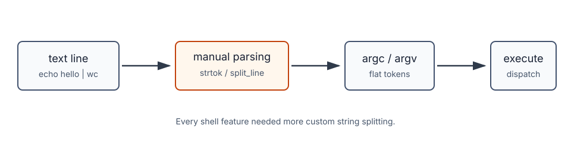
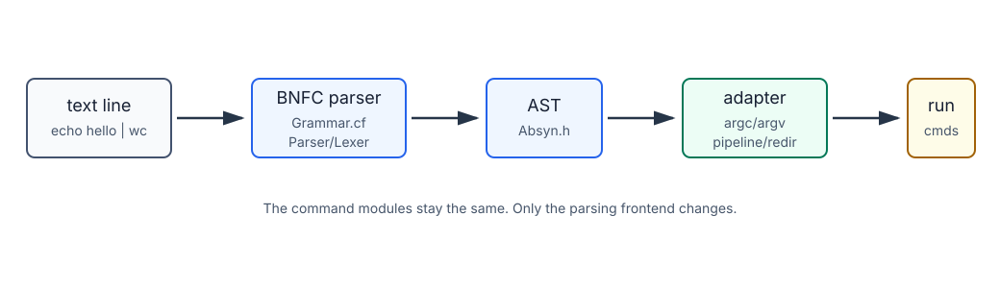
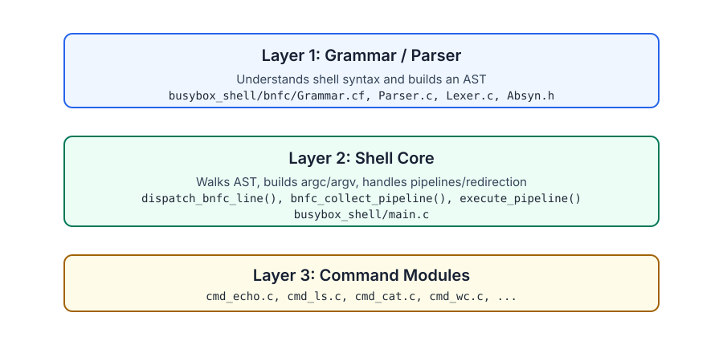

# BusyBox Shell Parser Migration

This document explains the difference between the previous command parsing
approach and the current BNFC grammar-based approach.

## Summary

The shell still uses the same command implementations:

- `cmd_echo.c`
- `cmd_ls.c`
- `cmd_cat.c`
- `cmd_wc.c`
- and the other `cmd_*.c` modules

The change is in how command lines are parsed before execution.

Previous flow:

```text
text line -> strtok/split_line -> argc/argv -> dispatch_command
```

Current flow:

```text
text line -> BNFC parser -> AST -> argc/argv or pipeline -> dispatch_command/execute_pipeline
```

The command registry is still the execution backend. BNFC is now the parsing
frontend.

## What We Have Implemented So Far

So far, the BusyBox shell has been updated in two main ways:

1. A BNFC grammar frontend was added.
2. The shell core now uses that grammar frontend before executing commands.
3. The existing natural-language `@` interface now feeds accepted suggestions
   into the same grammar-backed execution path.

The new parser lives in:

```text
busybox_shell/bnfc/Grammar.cf
```

The execution bridge lives in:

```text
busybox_shell/main.c
```

The top-level build now generates and links the BNFC parser automatically:

```text
busybox_shell/Makefile
```

In simple terms, the shell now does this:

```text
user input
  -> parse with BNFC
  -> build AST
  -> convert AST to argv/pipeline/redirection
  -> run existing command modules
```

Natural-language flow:

```text
@ request
  -> built-in phrase mapper or MYSH_LLM_HELPER/Ollama helper
  -> suggested shell command
  -> safety validation
  -> BNFC parser
  -> existing command execution
```

## Commands Covered By The Grammar Path

All current registered BusyBox shell commands can be reached through the BNFC
parser path because they all reduce to normal `argc` / `argv` execution after
parsing.

Currently covered commands:

```text
localdate
ls
cat
pkg
pwd
wc
touch
mkdir
rmdir
echo
whoami
clear
id
uname
head
tail
cp
mv
rm
dirname
du
procinfo
threads
```

Examples:

```sh
./busybox_shell echo hello
./busybox_shell ls Makefile
./busybox_shell cat Makefile
./busybox_shell wc Makefile
./busybox_shell head -n 1 Makefile
./busybox_shell tail -n 1 Makefile
./busybox_shell dirname a/b/c
```

These commands now go through:

```text
BNFC parser -> AST adapter -> dispatch_command()
```

The command modules themselves were not rewritten. For example, `cmd_echo.c`
and `cmd_ls.c` still implement the actual command behavior.

## Natural-Language Interface

The shell also has an interactive natural-language interface. Any interactive
line beginning with `@` is treated as a request instead of a direct shell
command.

Example:

```text
busybox_shell> @ show today's date
AI suggestion: localdate
Run it? [y/N]
```

Example:

```text
busybox_shell> @ list files
AI suggestion: ls
Run it? [y/N]
```

Example:

```text
busybox_shell> @ count words in Makefile
AI suggestion: wc Makefile
Run it? [y/N]
```

Internally, the natural-language path uses:

```c
handle_natural_language_request()
fallback_nl_to_command()
read_helper_command()
command_is_safe_to_dispatch()
dispatch_command_line()
```

There are two ways suggestions are produced:

1. Built-in fallback mapping for common requests.
2. External helper integration through `MYSH_LLM_HELPER`.

If `MYSH_LLM_HELPER` is not set and `./ollama_llm_helper.sh` is executable, the
shell can use that helper.

Example helper usage:

```sh
MYSH_LLM_HELPER="./ollama_llm_helper.sh" ./busybox_shell
```

The natural-language interface does not bypass the command system. A suggestion
such as:

```text
echo hello
```

is sent back through:

```text
dispatch_command_line()
  -> dispatch_bnfc_line()
  -> BNFC parser
  -> command execution
```

This means accepted `@` suggestions benefit from the same grammar-backed parser
as normal shell input.

The shell also validates suggestions before running them. It rejects unsupported
or unsafe shell syntax such as:

```text
;
&
|
<
>
`
$
(
)
```

That validation keeps the natural-language interface conservative: the helper
can suggest normal supported commands, but it cannot directly inject complex
shell syntax.

## Shell Syntax Implemented So Far

The grammar currently supports these shell forms.

Simple commands:

```sh
echo hello
ls Makefile
wc Makefile
```

Pipelines:

```sh
echo hello | wc
cat Makefile | head -n 1
```

Semicolon-separated jobs:

```sh
pwd ; echo done
```

Output redirection:

```sh
echo hello > out.txt
echo hello | wc > out.txt
```

Input redirection at the command-line level:

```sh
cat | head -n 1 < Makefile
```

Direct command mode:

```sh
./busybox_shell echo hello
./busybox_shell ls Makefile
```

Interactive mode:

```sh
./busybox_shell
busybox_shell> echo hello
busybox_shell> echo hello | wc
busybox_shell> pwd ; echo done
```

## What Happens Internally Now

For a simple command:

```sh
echo hello
```

The parser builds an AST like:

```text
MkCommandPart "echo" ["hello"]
```

The adapter converts it to:

```text
argc = 2
argv = ["echo", "hello", NULL]
```

Then the existing dispatcher runs:

```c
dispatch_command(argc, argv);
```

For a pipeline:

```sh
echo hello | wc
```

The parser builds a pipeline AST. The adapter converts it to:

```text
command_count = 2

command 1: ["echo", "hello", NULL]
command 2: ["wc", NULL]
```

Then the existing pipeline executor runs:

```c
execute_pipeline(command_count, argc_list, argv_list);
```

For redirection:

```sh
echo hello > out.txt
```

The parser records the output file in the AST. The adapter opens the file,
redirects stdout with `dup2`, runs the command, and restores stdout afterward.

## What Was Removed From Normal Command Execution

Earlier, normal command execution depended on manual parsing helpers like:

```text
split_line()
dispatch_pipeline_line()
dispatch_pipeline_from_argv()
```

The manual pipeline helpers have been removed from the normal execution path.
Normal command execution now goes through BNFC first.

`split_line()` still exists, but it is no longer the main command parser. It is
still used by helper logic such as natural-language command safety checks.

## Verification Added

A new Makefile target was added:

```sh
make test-bnfc
```

This test verifies that the registered commands work through the grammar-backed
execution path.

It covers:

```text
simple command execution
command options
file creation/removal commands
copy/move commands
process/thread demo commands
pipelines
semicolon-separated jobs
redirection
```

The broader regression test still works:

```sh
make test
```

## Test Cases

The following table is a fuller test matrix for the grammar-backed shell path.
The `Mode` column says whether the case is covered by `make test-bnfc`,
`make test`, or should be checked manually during a demo.

| ID | Category | Test command/input | Expected result | Mode |
|---:|---|---|---|---|
| 01.01 | Build | `make` | Generates BNFC parser files and builds `busybox_shell`. | Automated |
| 01.02 | Build | `make clean` | Removes shell binary, object files, and generated BNFC files. | Automated |
| 01.03 | Build | `make test-bnfc` | Runs grammar-backed command coverage. | Automated |
| 01.04 | Build | `make test` | Runs broader shell regression tests. | Automated |
| 01.05 | Branch setup | `git branch --show-current` | Shows `week08`. | Manual |
| 02.01 | Parser only | `cd bnfc && make test` | Prints parsed AST for sample pipeline/redirection input. | Automated |
| 02.02 | Parser only | `printf "echo hello\n" \| ./TestInput` | Prints `Parse Successful`. | Manual |
| 02.03 | Parser only | `printf "echo hello \| wc\n" \| ./TestInput` | Prints AST with `PipeCommand`. | Manual |
| 02.04 | Parser only | `printf "pwd ; echo done\n" \| ./TestInput` | Prints AST with multiple jobs. | Manual |
| 02.05 | Parser only | `printf "echo hello > out.txt\n" \| ./TestInput` | Prints AST with `OutputRedirection`. | Manual |
| 02.06 | Parser only | `printf "cat < Makefile\n" \| ./TestInput` | Prints AST with `InputRedirection`. | Manual |
| 02.07 | Parser only | `printf "sleep 5 &\n" \| ./TestInput` | Prints AST with `BackgroundJob`. | Manual |
| 02.08 | Parser only | `printf "cat < Makefile \| head\n" \| ./TestInput` | Fails because per-command pipeline redirection is not supported yet. | Manual |
| 03.01 | Direct command | `./busybox_shell localdate` | Prints local date. | Automated |
| 03.02 | Direct command | `./busybox_shell pkg` | Prints package name, version, description, and command list. | Automated |
| 03.03 | Direct command | `./busybox_shell pwd` | Prints current directory. | Automated |
| 03.04 | Direct command | `./busybox_shell echo hello grammar` | Prints `hello grammar`. | Automated |
| 03.05 | Direct command | `./busybox_shell echo -n hello` | Prints `hello` without trailing newline. | Automated |
| 03.06 | Direct command | `./busybox_shell ls Makefile` | Prints `Makefile`. | Automated |
| 03.07 | Direct command | `./busybox_shell cat Makefile` | Prints contents of `Makefile`. | Automated |
| 03.08 | Direct command | `./busybox_shell wc Makefile` | Prints line, word, and byte counts. | Automated |
| 03.09 | Direct command | `./busybox_shell whoami` | Prints current username. | Automated |
| 03.10 | Direct command | `./busybox_shell id` | Prints `uid=` and `gid=` information. | Automated |
| 03.11 | Direct command | `./busybox_shell uname` | Prints system name such as `Darwin`. | Automated |
| 03.12 | Direct command | `./busybox_shell procinfo` | Prints process identifiers. | Automated |
| 03.13 | Direct command | `./busybox_shell threads` | Starts worker threads and prints results. | Automated |
| 04.01 | Command options | `./busybox_shell localdate -h` | Prints `localdate` usage text. | Automated |
| 04.02 | Command options | `./busybox_shell pkg -h` | Prints `pkg` usage and subcommands. | Automated |
| 04.03 | Command options | `./busybox_shell ls -a` | Lists hidden and normal files. | Automated |
| 04.04 | Command options | `./busybox_shell ls -l` | Prints long listing. | Manual |
| 04.05 | Command options | `./busybox_shell ls -r` | Prints reversed listing. | Manual |
| 04.06 | Command options | `./busybox_shell ls -S` | Sorts by size. | Manual |
| 04.07 | Command options | `./busybox_shell head -n 1 test_bnfc_lines.tmp` | Prints first line. | Automated |
| 04.08 | Command options | `./busybox_shell tail -n 1 test_bnfc_lines.tmp` | Prints last line. | Automated |
| 04.09 | Command options | `./busybox_shell mkdir -p test_bnfc_dir/subdir` | Creates nested directory. | Automated |
| 04.10 | Command options | `./busybox_shell clear > /dev/null` | Runs clear command without visible output. | Automated |
| 05.01 | File command | `./busybox_shell touch test_bnfc_touch.tmp` | Creates or updates file. | Automated |
| 05.02 | File command | `./busybox_shell cp test_bnfc_lines.tmp test_bnfc_copy.tmp` | Creates copied file. | Automated |
| 05.03 | File command | `./busybox_shell mv test_bnfc_copy.tmp test_bnfc_move.tmp` | Renames copied file. | Automated |
| 05.04 | File command | `./busybox_shell dirname a/b/c` | Prints `a/b`. | Automated |
| 05.05 | File command | `./busybox_shell du test_bnfc_move.tmp` | Prints disk usage and file name. | Automated |
| 05.06 | File command | `./busybox_shell rm test_bnfc_lines.tmp test_bnfc_move.tmp test_bnfc_touch.tmp` | Removes test files. | Automated |
| 05.07 | File command | `./busybox_shell rmdir test_bnfc_dir/subdir` | Removes empty subdirectory. | Automated |
| 05.08 | File command | `./busybox_shell rmdir test_bnfc_dir` | Removes empty parent directory. | Automated |
| 06.01 | JSON | `./busybox_shell help --json` | Prints JSON command catalog. | Manual |
| 06.02 | JSON | `./busybox_shell help ls --json` | Prints JSON metadata for `ls`. | Manual |
| 06.03 | JSON | `./busybox_shell ls --json` | Prints JSON directory listing. | Manual |
| 06.04 | JSON | `./busybox_shell pkg --json` | Prints JSON package metadata. | Manual |
| 06.05 | JSON | `./busybox_shell id --json` | Prints JSON user/group IDs. | Manual |
| 06.06 | JSON | `./busybox_shell uname --json` | Prints JSON system metadata. | Manual |
| 06.07 | JSON | `./busybox_shell procinfo --json` | Prints JSON process information. | Manual |
| 06.08 | JSON | `./busybox_shell threads --json -n 2` | Prints JSON thread-demo result. | Manual |
| 06.09 | JSON | `./busybox_shell wc --json Makefile` | Prints JSON word-count output. | Manual |
| 06.10 | JSON | `./busybox_shell echo --json hello` | Prints JSON echo output. | Manual |
| 07.01 | Interactive | `printf "echo hello\nexit\n" \| ./busybox_shell` | Shell prints `hello`. | Automated |
| 07.02 | Interactive | `printf "localdate\nexit\n" \| ./busybox_shell` | Shell prints local date. | Automated |
| 07.03 | Interactive | `printf "pkg\nexit\n" \| ./busybox_shell` | Shell prints package metadata. | Automated |
| 07.04 | Interactive | `printf "pwd\nexit\n" \| ./busybox_shell` | Shell prints current directory. | Automated |
| 07.05 | Interactive | `printf "help mkdir\nexit\n" \| ./busybox_shell` | Shell prints `mkdir` usage. | Automated |
| 08.01 | Pipeline | `printf "echo hello \| wc\nexit\n" \| ./busybox_shell` | Shell prints count output from `wc`. | Automated |
| 08.02 | Pipeline | `printf "cat Makefile \| head -n 1\nexit\n" \| ./busybox_shell` | Prints first line of `Makefile`. | Manual |
| 08.03 | Pipeline | `printf "cat Makefile \| wc\nexit\n" \| ./busybox_shell` | Prints count output from `wc`. | Manual |
| 08.04 | Pipeline | `printf "echo hello \| wc \| cat\nexit\n" \| ./busybox_shell` | Executes three-command pipeline. | Manual |
| 09.01 | Semicolon jobs | `printf "pwd ; echo done\nexit\n" \| ./busybox_shell` | Prints current directory and `done`. | Automated |
| 09.02 | Semicolon jobs | `printf "echo one ; echo two ; echo three\nexit\n" \| ./busybox_shell` | Prints three lines in order. | Manual |
| 09.03 | Semicolon jobs | `printf "localdate ; whoami\nexit\n" \| ./busybox_shell` | Prints date and username. | Manual |
| 10.01 | Redirection | `printf "echo hello > test_bnfc_out.tmp\ncat test_bnfc_out.tmp\nrm test_bnfc_out.tmp\nexit\n" \| ./busybox_shell` | File receives `hello`, then `cat` prints it. | Automated |
| 10.02 | Redirection | `printf "echo hello \| wc > test_bnfc_out.tmp\ncat test_bnfc_out.tmp\nrm test_bnfc_out.tmp\nexit\n" \| ./busybox_shell` | File receives `wc` output, then `cat` prints it. | Automated |
| 10.03 | Redirection | `printf "cat \| head -n 1 < Makefile\nexit\n" \| ./busybox_shell` | Prints first line of `Makefile`. | Automated |
| 10.04 | Redirection | `printf "cat < Makefile \| head -n 1\nexit\n" \| ./busybox_shell` | Fails safely; per-command redirection inside a pipeline is not supported yet. | Manual |
| 10.05 | Redirection | `printf "echo hello >> out.txt\nexit\n" \| ./busybox_shell` | Fails safely; append redirection is not implemented yet. | Manual |
| 11.01 | Natural language | `@ show today's date` | Suggests `localdate`; if accepted, runs through BNFC command path. | Manual |
| 11.02 | Natural language | `@ list files` | Suggests `ls`; if accepted, runs through BNFC command path. | Manual |
| 11.03 | Natural language | `@ where am I` | Suggests `pwd`; if accepted, runs through BNFC command path. | Manual |
| 11.04 | Natural language | `@ print hello` | Suggests `echo hello`; if accepted, runs through BNFC command path. | Manual |
| 11.05 | Natural language | `@ help of ls` | Suggests `help ls`; if accepted, prints help. | Manual |
| 11.06 | Natural language | `@ count words in Makefile` | Suggests `wc Makefile`; if accepted, runs through BNFC command path. | Manual |
| 11.07 | Natural language | `@ show first lines of Makefile` | Suggests `head Makefile`; if accepted, runs through BNFC command path. | Manual |
| 11.08 | Natural language | `@ show last lines of Makefile` | Suggests `tail Makefile`; if accepted, runs through BNFC command path. | Manual |
| 11.09 | Natural language | `@ list files as json` | Suggests `ls --json`; if accepted, runs through BNFC command path. | Manual |
| 11.10 | Natural language safety | helper suggests `echo hi ; rm file` | Rejected by safety validation because complex shell operators are not allowed. | Manual |
| 12.01 | Unsupported syntax | `printf "echo \"hello world\"\nexit\n" \| ./busybox_shell` | Fails safely; quoted strings are not implemented yet. | Manual |
| 12.02 | Unsupported syntax | `printf "x=hello\nexit\n" \| ./busybox_shell` | Fails safely; shell variables are not implemented yet. | Manual |
| 12.03 | Unsupported syntax | `printf "echo $HOME\nexit\n" \| ./busybox_shell` | Fails safely; variable expansion is not implemented yet. | Manual |
| 12.04 | Unsupported syntax | `printf "sleep 5 &\nexit\n" \| ./busybox_shell` | Parses background job, but execution reports it is not implemented yet. | Manual |
| 12.05 | Unsupported syntax | `printf "echo hi && echo bye\nexit\n" \| ./busybox_shell` | Fails safely; logical operators are not implemented yet. | Manual |
| 12.06 | Unsupported syntax | `printf "echo hi || echo bye\nexit\n" \| ./busybox_shell` | Fails safely; logical operators are not implemented yet. | Manual |
| 13.01 | Error handling | `./busybox_shell unknown_command` | Reports unknown command. | Manual |
| 13.02 | Error handling | `printf "\| wc\nexit\n" \| ./busybox_shell` | Fails safely with parse error. | Manual |
| 13.03 | Error handling | `printf "echo hello \|\nexit\n" \| ./busybox_shell` | Fails safely with parse error. | Manual |
| 13.04 | Error handling | `printf "cat < missing-file\nexit\n" \| ./busybox_shell` | Reports missing file error. | Manual |
| 13.05 | Error handling | `printf "rmdir nonempty-dir\nexit\n" \| ./busybox_shell` | Reports command-specific failure. | Manual |

Automated target:

```sh
make test-bnfc
```

This target covers the command execution tests and the interactive grammar
tests. Natural-language tests are interactive by design because the shell asks
for confirmation before running the suggestion.

## Presentation Overview







## Previous Approach: Manual Token Splitting

Earlier, simple commands were parsed by `split_line()` in `main.c`.

Example input:

```sh
echo hello world
```

The old parser split on whitespace:

```text
argv[0] = "echo"
argv[1] = "hello"
argv[2] = "world"
```

Then it called:

```c
dispatch_command(argc, argv);
```

Core snippet from the old approach:

```c
static int split_line(char *line, char **argv, int max_args)
{
    int argc = 0;
    char *token = strtok(line, " \t\r\n");

    while (token != NULL && argc < max_args - 1) {
        argv[argc++] = token;
        token = strtok(NULL, " \t\r\n");
    }

    argv[argc] = NULL;
    return argc;
}
```

Pipelines were handled separately. A command like:

```sh
echo hello | wc
```

was split once by the pipe character:

```text
segment 1: echo hello
segment 2: wc
```

Then each segment was split again by whitespace.

This worked for basic cases, but the shell did not have a formal command-line
syntax. Each new shell feature required more manual string handling.

## Current Approach: BNFC Grammar

The grammar lives in:

```text
busybox_shell/bnfc/Grammar.cf
```

The key grammar rules are:

```bnf
StartInput. Input ::= [Job] ;

ForegroundJob. Job ::= CommandLine ;
BackgroundJob. Job ::= CommandLine "&" ;

separator nonempty Job ";" ;

CommandWithRedir. CommandLine ::= Pipeline [Redirection] ;

SingleCommand. Pipeline ::= CommandPart ;
PipeCommand. Pipeline ::= CommandPart "|" Pipeline ;

MkCommandPart. CommandPart ::= Word [Word] ;

InputRedirection. Redirection ::= "<" Word ;
OutputRedirection. Redirection ::= ">" Word ;
```

BNFC generates parser files from that grammar:

```text
Absyn.c / Absyn.h
Lexer.c
Parser.c / Parser.h
Printer.c / Printer.h
Test.c
```

Those files are generated during the build and are ignored by git.

The grammar parses input into an AST. The adapter code in `main.c` walks the AST
and converts it into the data structures the existing shell already knows how to
execute.

Important adapter functions:

```c
dispatch_bnfc_line()
bnfc_dispatch_job()
bnfc_dispatch_command_line()
bnfc_collect_pipeline()
bnfc_build_argv()
```

The entry point is:

```c
static int dispatch_bnfc_line(const char *line)
{
    Input input;
    ListJob jobs;
    int status = 0;

    input = psInput(line);
    if (input == NULL || input->kind != is_StartInput) {
        return 2;
    }

    jobs = input->u.startInput_.listjob_;
    while (jobs != NULL) {
        status = bnfc_dispatch_job(jobs->job_);
        if (status < 0) {
            break;
        }
        jobs = jobs->listjob_;
    }

    free_Input(input);
    return status;
}
```

The important idea is:

```text
BNFC does not execute commands.
It only gives main.c a structured AST to execute.
```

## Example: Simple Command

Input:

```sh
echo hello
```

BNFC parses it roughly as:

```text
StartInput [
  ForegroundJob (
    CommandWithRedir (
      SingleCommand (
        MkCommandPart "echo" ["hello"]
      )
      []
    )
  )
]
```

The adapter converts that AST into:

```text
argc = 2
argv = ["echo", "hello", NULL]
```

Then it calls:

```c
dispatch_command(argc, argv);
```

Adapter snippet:

```c
static int bnfc_build_argv(CommandPart part, char **argv, int max_args)
{
    ListWord words;
    int argc = 0;

    argv[argc++] = part->u.mkCommandPart_.word_;
    words = part->u.mkCommandPart_.listword_;

    while (words != NULL && argc < max_args - 1) {
        argv[argc++] = words->word_;
        words = words->listword_;
    }

    argv[argc] = NULL;
    return argc;
}
```

## Example: Pipeline

Input:

```sh
echo hello | wc
```

BNFC parses it roughly as:

```text
StartInput [
  ForegroundJob (
    CommandWithRedir (
      PipeCommand
        (MkCommandPart "echo" ["hello"])
        (SingleCommand (MkCommandPart "wc" []))
      []
    )
  )
]
```

The adapter converts it into:

```text
command_count = 2

command 1:
argc = 2
argv = ["echo", "hello", NULL]

command 2:
argc = 1
argv = ["wc", NULL]
```

Then it calls:

```c
execute_pipeline(command_count, argc_list, argv_list);
```

Adapter snippet:

```c
if (command_count == 1) {
    return bnfc_dispatch_simple_with_redirection(argc_list[0], argv_list[0],
                                                input_file, output_file);
}

return execute_pipeline(command_count, argc_list, argv_list);
```

## Example: Semicolon-Separated Jobs

Input:

```sh
pwd ; echo done
```

BNFC parses this as a list of jobs:

```text
StartInput [
  ForegroundJob (... pwd ...),
  ForegroundJob (... echo done ...)
]
```

The adapter executes each job in order.

## Example: Redirection

Input:

```sh
echo hello > out.txt
```

BNFC parses the output redirection as part of the command line. The adapter
opens `out.txt`, redirects `STDOUT_FILENO` with `dup2`, runs the existing
command implementation, and then restores stdout.

Pipeline redirection also works at the command-line level:

```sh
echo hello | wc > out.txt
```

Redirection snippet:

```c
static int bnfc_redirect_fd(const char *path, int target_fd, int flags, mode_t mode)
{
    int fd = open(path, flags, mode);

    if (fd < 0) {
        fprintf(stderr, "%s: %s\n", path, strerror(errno));
        return 1;
    }

    if (dup2(fd, target_fd) < 0) {
        fprintf(stderr, "dup2: %s\n", strerror(errno));
        close(fd);
        return 1;
    }

    close(fd);
    return 0;
}
```

For input redirection with pipelines, use the current grammar form:

```sh
cat | head -n 1 < Makefile
```

## What Changed In The Code

Added:

```text
busybox_shell/bnfc/Grammar.cf
busybox_shell/bnfc/Makefile
busybox_shell/bnfc/README.md
busybox_shell/bnfc/.gitignore
```

Updated:

```text
busybox_shell/Makefile
busybox_shell/main.c
```

The top-level Makefile now builds the BNFC parser before linking
`busybox_shell`.

Build snippet:

```make
BNFC_SRC = $(BNFC_DIR)/Absyn.c \
           $(BNFC_DIR)/Buffer.c \
           $(BNFC_DIR)/Lexer.c \
           $(BNFC_DIR)/Parser.c

bnfc_parser:
	$(MAKE) -C $(BNFC_DIR) build

$(TARGET): bnfc_parser $(SRC)
	$(CC) $(CFLAGS) -o $(TARGET) $(SRC)
```

## What Did Not Change

The command modules did not need to change:

```text
cmd_echo.c
cmd_ls.c
cmd_cat.c
cmd_wc.c
...
```

They still receive normal `argc` and `argv` values.

The command registry also remains the backend:

```c
find_command(argv[0]);
cmd->run(argc, argv);
```

## Current Limitations

The current grammar is intentionally small. It supports:

```text
simple commands
pipelines
semicolon-separated jobs
top-level input/output redirection
```

It does not yet fully support:

```text
quoted strings: echo "hello world"
variables: echo $HOME
background execution: sleep 5 &
per-command redirection inside pipelines: cat < Makefile | head -n 1
append redirection: >>
```

Background jobs are parsed, but execution is not implemented yet.

## How To Verify

Build and run the BNFC command coverage test:

```sh
cd busybox_shell
source ~/.ghcup/env
export PATH="$HOME/.local/bin:$PATH"
make test-bnfc
```

Run the broader shell regression test:

```sh
make test
```

Inspect parser output directly:

```sh
cd busybox_shell/bnfc
make test
printf "echo hello | wc > out.txt\n" | ./TestInput
```

## Why This Is Better

The previous approach was easy to start with, but every shell feature required
more custom string manipulation.

The BNFC approach gives the shell a formal syntax:

```text
grammar rule -> AST node -> execution adapter
```

That makes future features easier to add systematically. Instead of adding
another string split, we add a grammar rule and then handle the corresponding
AST constructor.

## Slide-Friendly Talking Points

- The command modules did not change.
- The parser changed from manual string splitting to a formal grammar.
- BNFC gives us an AST, which makes pipelines and redirection explicit.
- `main.c` is now the bridge between syntax and execution.
- Future shell features should be added as grammar rules plus AST adapter cases.
