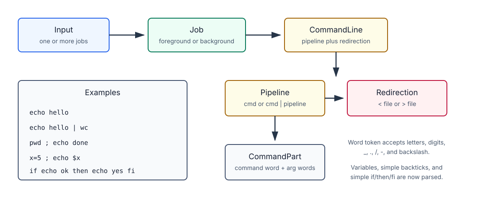

# BusyBox Shell Parser Migration

This document explains the difference between the previous command parsing
approach and the current BNFC grammar-based approach.

## Summary

The shell still uses the same command implementations:

- `cmd_echo.c`
- `cmd_ls.c`
- `cmd_cat.c`
- `cmd_wc.c`
- and the other `cmd_*.c` modules

The change is in how command lines are parsed before execution.

Previous flow:

```text
text line -> strtok/split_line -> argc/argv -> dispatch_command
```

Current flow:

```text
text line -> BNFC parser -> AST -> argc/argv or pipeline -> dispatch_command/execute_pipeline
```

The command registry is still the execution backend. BNFC is now the parsing
frontend.

## Presentation Roadmap

Use this order for the presentation:

1. Show the old parser flow and its token-based limits.
2. Introduce `Grammar.cf` as the formal syntax for the shell.
3. Show how BNFC generates lexer/parser/AST files.
4. Explain the adapter layer that converts AST nodes back to `argc` / `argv`.
5. Demonstrate simple commands, pipelines, semicolons, and redirection.
6. Show the regression tests from `test.sh`.
7. Explain the bugs found during migration and how they were fixed.

## What We Have Implemented So Far

So far, the BusyBox shell has been updated in three main ways:

1. A BNFC grammar frontend was added.
2. The shell core now uses that grammar frontend before executing commands.
3. The existing natural-language `@` interface now feeds accepted suggestions
   into the same grammar-backed execution path.

The new parser lives in:

```text
busybox_shell/bnfc/Grammar.cf
```

The execution bridge lives in:

```text
busybox_shell/main.c
```

The top-level build now generates and links the BNFC parser automatically:

```text
busybox_shell/Makefile
```

In simple terms, the shell now does this:

```text
user input
  -> parse with BNFC
  -> build AST
  -> convert AST to argv/pipeline/redirection
  -> run existing command modules
```

Natural-language flow:

```text
@ request
  -> built-in phrase mapper or MYSH_LLM_HELPER/Ollama helper
  -> suggested shell command
  -> safety validation
  -> BNFC parser
  -> existing command execution
```

## Commands Covered By The Grammar Path

All current registered BusyBox shell commands can be reached through the BNFC
parser path because they all reduce to normal `argc` / `argv` execution after
parsing.

Currently covered commands:

```text
localdate
ls
cat
pkg
pwd
wc
touch
mkdir
rmdir
echo
whoami
clear
id
uname
head
tail
cp
mv
rm
dirname
du
procinfo
threads
```

Examples:

```sh
./busybox_shell echo hello
./busybox_shell ls Makefile
./busybox_shell cat Makefile
./busybox_shell wc Makefile
./busybox_shell head -n 1 Makefile
./busybox_shell tail -n 1 Makefile
./busybox_shell dirname a/b/c
```

These commands now go through:

```text
BNFC parser -> AST adapter -> dispatch_command()
```

The command modules themselves were not rewritten for parsing. For example,
`cmd_echo.c` and `cmd_ls.c` still implement the actual command behavior. One
small `cmd_echo.c` correctness fix was added after grammar-backed testing found
an escape-handling regression.

## Natural-Language Interface

The shell also has an interactive natural-language interface. Any interactive
line beginning with `@` is treated as a request instead of a direct shell
command.

Example:

```text
busybox_shell> @ show today's date
AI suggestion: localdate
Run it? [y/N]
```

Example:

```text
busybox_shell> @ list files
AI suggestion: ls
Run it? [y/N]
```

Example:

```text
busybox_shell> @ count words in Makefile
AI suggestion: wc Makefile
Run it? [y/N]
```

Internally, the natural-language path uses:

```c
handle_natural_language_request()
fallback_nl_to_command()
read_helper_command()
command_is_safe_to_dispatch()
dispatch_command_line()
```

There are two ways suggestions are produced:

1. Built-in fallback mapping for common requests.
2. External helper integration through `MYSH_LLM_HELPER`.

If `MYSH_LLM_HELPER` is not set and `./ollama_llm_helper.sh` is executable, the
shell can use that helper.

Example helper usage:

```sh
MYSH_LLM_HELPER="./ollama_llm_helper.sh" ./busybox_shell
```

The natural-language interface does not bypass the command system. A suggestion
such as:

```text
echo hello
```

is sent back through:

```text
dispatch_command_line()
  -> dispatch_bnfc_line()
  -> BNFC parser
  -> command execution
```

This means accepted `@` suggestions benefit from the same grammar-backed parser
as normal shell input.

The shell also validates suggestions before running them. It rejects unsupported
or unsafe shell syntax such as:

```text
;
&
|
<
>
`
$
(
)
```

That validation keeps the natural-language interface conservative: the helper
can suggest normal supported commands, but it cannot directly inject complex
shell syntax.

## Shell Syntax Implemented So Far

The grammar currently supports these shell forms.



Simple commands:

```sh
echo hello
ls Makefile
wc Makefile
```

Pipelines:

```sh
echo hello | wc
cat Makefile | head -n 1
```

Semicolon-separated jobs:

```sh
pwd ; echo done
```

Output redirection:

```sh
echo hello > out.txt
echo hello | wc > out.txt
```

Input redirection at the command-line level:

```sh
cat | head -n 1 < Makefile
```

Direct command mode:

```sh
./busybox_shell echo hello
./busybox_shell ls Makefile
```

Interactive mode:

```sh
./busybox_shell
busybox_shell> echo hello
busybox_shell> echo hello | wc
busybox_shell> pwd ; echo done
```

## Basic Grammar Features

The grammar file is small, but it captures the core shell shapes explicitly.

| Grammar feature | Rule or token | Meaning | Example |
|---|---|---|---|
| Entry point | `entrypoints Input ;` | Parser starts from a full shell input line. | `echo hello` |
| Comments | `comment "/*" "*/" ;`, `comment "//" "\n" ;` | Allows comments in grammar-level input. | `// note` |
| Word token | `token Word (...) ;` | Defines command names, flags, paths, and simple arguments. | `head`, `-n`, `Makefile` |
| Job list | `StartInput. Input ::= [Job] ;` | A line can contain multiple jobs. | `pwd ; echo done` |
| Foreground job | `ForegroundJob. Job ::= CommandLine ;` | Normal command execution. | `ls` |
| Background job syntax | `BackgroundJob. Job ::= CommandLine "&" ;` | Syntax is parsed; execution is not implemented yet. | `sleep 5 &` |
| Semicolon separator | `separator nonempty Job ";" ;` | Runs jobs in order. | `pwd ; whoami` |
| Pipeline | `PipeCommand. Pipeline ::= CommandPart "\|" Pipeline ;` | Connects commands through pipes. | `echo hi \| wc` |
| Command arguments | `MkCommandPart. CommandPart ::= Word [Word] ;` | A command is a word followed by zero or more words. | `echo hello world` |
| Redirection | `InputRedirection`, `OutputRedirection` | Supports top-level `< file` and `> file`. | `echo hi > out.txt` |

Important point for the presentation: BNFC parses syntax only. It does not
implement `ls`, `echo`, or `wc`; those still live in the existing `cmd_*.c`
files.

## What Happens Internally Now

For a simple command:

```sh
echo hello
```

The parser builds an AST like:

```text
MkCommandPart "echo" ["hello"]
```

The adapter converts it to:

```text
argc = 2
argv = ["echo", "hello", NULL]
```

Then the existing dispatcher runs:

```c
dispatch_command(argc, argv);
```

For a pipeline:

```sh
echo hello | wc
```

The parser builds a pipeline AST. The adapter converts it to:

```text
command_count = 2

command 1: ["echo", "hello", NULL]
command 2: ["wc", NULL]
```

Then the existing pipeline executor runs:

```c
execute_pipeline(command_count, argc_list, argv_list);
```

For redirection:

```sh
echo hello > out.txt
```

The parser records the output file in the AST. The adapter opens the file,
redirects stdout with `dup2`, runs the command, and restores stdout afterward.

## What Was Removed From Normal Command Execution

Earlier, normal command execution depended on manual parsing helpers like:

```text
split_line()
dispatch_pipeline_line()
dispatch_pipeline_from_argv()
```

The manual pipeline helpers have been removed from the normal execution path.
Normal command execution now goes through BNFC first.

`split_line()` still exists, but it is no longer the main command parser. It is
still used by helper logic such as natural-language command safety checks.

## Verification Added

A new Makefile target was added:

```sh
make test-bnfc
```

This test verifies that the registered commands work through the grammar-backed
execution path.

It covers:

```text
simple command execution
command options
file creation/removal commands
copy/move commands
process/thread demo commands
pipelines
semicolon-separated jobs
redirection
```

The broader regression test still works:

```sh
make test
```

## Bugs Encountered During Migration

| Bug or confusion | What happened | Fix or explanation |
|---|---|---|
| Generated grammar files were missing | Files such as `Absyn.c`, `Parser.c`, `Lexer.c`, and `Printer.c` are generated by BNFC and are ignored by git. Opening the folder before generation can make it look incomplete. | The top-level `Makefile` builds `bnfc` first, and `busybox_shell/bnfc/Makefile` regenerates parser files from `Grammar.cf`. |
| `Lexer.h` expectation | BNFC's C backend generates `Lexer.c`, but not a `Lexer.h` header. | BusyBox shell code includes `Parser.h` and `Absyn.h`; it does not depend on `Lexer.h`. |
| Direct command pipelines need quoted pipe symbols | In normal terminal syntax, an unquoted `|` is consumed by the host shell before `busybox_shell` receives it. | Direct-mode tests pass `"|"` as an argument, for example `./busybox_shell echo hello "|" wc`. Interactive mode can type `echo hello | wc` normally. |
| `echo -e 'a\nb'` failed | The grammar rejected `\`, and echo spacing after options used a hard-coded argument index. | The `Word` token now allows backslash, and `cmd_echo.c` tracks the first real text argument after options. |

### Detailed Example: `echo -e` With Escaped Newlines

One regression test exposed an important parser/detail bug:

```sh
./busybox_shell echo -e 'a\nb' | grep -q '^b$'
```

Expected behavior:

```text
a
b
```

The test checks that `echo -e` turns `\n` into a real newline and that the
second line contains `b`.

### Why It Failed

There were two separate issues.

First, the BNFC grammar did not allow backslash characters inside a `Word`
token. The grammar accepted letters, digits, `_`, `.`, `/`, and `-`, but not
`\`. That meant this argument could not be parsed correctly:

```text
a\nb
```

Second, `cmd_echo.c` had spacing logic that depended on a hard-coded argument
position. That worked for some simple cases, but options such as `-e`, `-E`,
and `-n` move the first real text argument to a different index.

### Grammar Fix

The `Word` token in `busybox_shell/bnfc/Grammar.cf` was updated to accept a
backslash:

```bnf
token Word ((letter | digit | '_' | '.' | '/' | '-' | '\\')+) ;
```

This lets BNFC parse arguments such as:

```text
a\nb
```

### Echo Spacing Fix

After parsing options, `cmd_echo.c` now remembers where the text arguments
start:

```c
int text_start = index;

for (; index < argc; index++) {
    if (index > text_start) {
        putchar(' ');
    }
    ...
}
```

This makes spacing depend on the actual first text argument instead of a fixed
argument number.

### Verification

The fixed command:

```sh
./busybox_shell echo -e 'a\nb' | grep -q '^b$'
echo $?
```

Expected result:

```text
0
```

This confirms that the command prints a real newline and that the pipeline can
find `b` on its own line.

## Test Cases

The table below mirrors the automated regression suite in `busybox_shell/test.sh`.
It includes all 148 test cases printed by the script. The command/check
column is the actual shell expression used by the test.

| ID | Test section | Test case | Command/check from `test.sh` |
|---:|---|---|---|
| 01.01 | Testing version output | busybox_shell version | `./busybox_shell --version \| grep -q "busybox_shell 1.0.0"` |
| 01.02 | Testing version output | ls command version | `./busybox_shell ls --version \| grep -q "ls (busybox_shell) 1.0.0"` |
| 01.03 | Testing version output | pkg command version | `./busybox_shell pkg --version \| grep -q "pkg (busybox_shell) 1.0.0"` |
| 01.04 | Testing version output | rm json version | `./busybox_shell rm --version --json \| grep -q "\"version\":\"1.0.0\""` |
| 01.05 | Testing version output | help shows common features | `./busybox_shell help \| grep -q "Common features:"` |
| 01.06 | Testing version output | command help shows version flag | `./busybox_shell help ls \| grep -q "show command version and exit"` |
| 01.07 | Testing version output | help shows natural-language interface | `./busybox_shell help \| grep -q "@ <request>"` |
| 02.01 | Testing natural-language @ interface | @ list files suggests ls | `printf "@list files\nexit\n" \| ./busybox_shell \| grep -q "AI suggestion: ls"` |
| 02.02 | Testing natural-language @ interface | @ where am I suggests pwd | `printf "@where am I\nexit\n" \| ./busybox_shell \| grep -q "AI suggestion: pwd"` |
| 02.03 | Testing natural-language @ interface | @ create directory suggests mkdir | `printf "@create a directory named ai_test_dir\nexit\n" \| ./busybox_shell \| grep -q "AI suggestion: mkdir ai_test_dir"` |
| 02.04 | Testing natural-language @ interface | @ print hello suggests echo | `printf "@print hello\nexit\n" \| ./busybox_shell \| grep -q "AI suggestion: echo hello"` |
| 02.05 | Testing natural-language @ interface | @ help of ls suggests help ls | `printf "@help of ls\nexit\n" \| ./busybox_shell \| grep -q "AI suggestion: help ls"` |
| 02.06 | Testing natural-language @ interface | @ what mkdir does suggests help mkdir | `printf "@what does mkdir do\nexit\n" \| ./busybox_shell \| grep -q "AI suggestion: help mkdir"` |
| 02.07 | Testing natural-language @ interface | @ count words suggests wc | `printf "@count words in Makefile\nexit\n" \| ./busybox_shell \| grep -q "AI suggestion: wc Makefile"` |
| 02.08 | Testing natural-language @ interface | @ first lines suggests head | `printf "@show first lines of Makefile\nexit\n" \| ./busybox_shell \| grep -q "AI suggestion: head Makefile"` |
| 02.09 | Testing natural-language @ interface | @ last lines suggests tail | `printf "@show last lines of Makefile\nexit\n" \| ./busybox_shell \| grep -q "AI suggestion: tail Makefile"` |
| 02.10 | Testing natural-language @ interface | @ json list suggests ls --json | `printf "@list file names in json format\nexit\n" \| ./busybox_shell \| grep -q "AI suggestion: ls --json"` |
| 02.11 | Testing natural-language @ interface | @ reverse list suggests ls -r | `printf "@list files in reverse order\nexit\n" \| ./busybox_shell \| grep -q "AI suggestion: ls -r"` |
| 02.12 | Testing natural-language @ interface | @ hidden details suggests ls -a -l | `printf "@list hidden files with details\nexit\n" \| ./busybox_shell \| grep -q "AI suggestion: ls -a -l"` |
| 03.01 | Testing localdate | localdate prints date | `./busybox_shell localdate \| grep -Eq "Local Date: [0-9]{4}-[0-9]{2}-[0-9]{2}"` |
| 03.02 | Testing localdate | localdate help prints usage | `./busybox_shell localdate -h \| grep -q "Usage:"` |
| 03.03 | Testing localdate | localdate json includes date | `./busybox_shell localdate --json \| grep -q "\"date\":"` |
| 04.01 | Testing ls | ls shows Makefile | `./busybox_shell ls \| grep -q "Makefile"` |
| 04.02 | Testing ls | ls help prints usage | `./busybox_shell ls -h \| grep -q "Usage:"` |
| 04.03 | Testing ls | ls accepts /tmp path | `./busybox_shell ls /tmp` |
| 04.04 | Testing ls | ls json includes Makefile | `./busybox_shell ls --json \| grep -q "\"name\":\"Makefile\""` |
| 04.05 | Testing ls | ls json help includes summary | `./busybox_shell ls -h --json \| grep -q "\"summary\":\"list directory contents\""` |
| 04.06 | Testing ls | help ls json includes description | `./busybox_shell help ls --json \| grep -q "\"description\":\"List files in a directory"` |
| 04.07 | Testing ls | help json includes commands | `./busybox_shell help --json \| grep -q "\"commands\":"` |
| 04.08 | Testing ls | ls -l shows Makefile | `./busybox_shell ls -l Makefile \| grep -q "Makefile"` |
| 04.09 | Testing ls | ls -S sorts and shows Makefile | `./busybox_shell ls -S \| grep -q "Makefile"` |
| 04.10 | Testing ls | ls -t sorts and shows Makefile | `./busybox_shell ls -t \| grep -q "Makefile"` |
| 04.11 | Testing ls | ls -r reverses and shows Makefile | `./busybox_shell ls -r \| grep -q "Makefile"` |
| 04.12 | Testing ls | ls -R shows nested file | `./busybox_shell ls -R test_ls_recursive \| grep -q "nested.txt"` |
| 05.01 | Testing cat | cat prints Makefile content | `./busybox_shell cat Makefile \| grep -q "TARGET = busybox_shell"` |
| 05.02 | Testing cat | cat help prints usage | `./busybox_shell cat -h \| grep -q "Usage:"` |
| 05.03 | Testing cat | cat json includes content | `./busybox_shell cat --json Makefile \| grep -q "\"content\":"` |
| 05.04 | Testing cat | wc json includes bytes | `./busybox_shell wc --json Makefile \| grep -q "\"bytes\":"` |
| 05.05 | Testing cat | cat -n numbers lines | `./busybox_shell cat -n cat_features.tmp \| grep -q "1"` |
| 05.06 | Testing cat | cat -b numbers nonblank lines | `./busybox_shell cat -b cat_features.tmp \| grep -q "2"` |
| 05.07 | Testing cat | cat -s squeezes blank lines | `./busybox_shell cat -s cat_features.tmp \| grep -q "^$"` |
| 05.08 | Testing cat | cat -E marks line endings | `./busybox_shell cat -E cat_features.tmp \| grep -q "a\\$"` |
| 06.01 | Testing pkg | pkg prints busybox package details | `./busybox_shell pkg` |
| 06.02 | Testing pkg | pkg output includes package name | `./busybox_shell pkg \| grep -q "Package: busybox_shell"` |
| 06.03 | Testing pkg | pkg output includes command summary | `./busybox_shell pkg \| grep -q "pkg - manage shell packages"` |
| 06.04 | Testing pkg | pkg json includes package name | `./busybox_shell pkg --json \| grep -q "\"name\":\"busybox_shell\""` |
| 06.05 | Testing pkg | pkg help prints usage | `./busybox_shell pkg -h \| grep -q "Usage:"` |
| 06.06 | Testing pkg | pkg help includes install usage | `./busybox_shell pkg -h \| grep -q "pkg install"` |
| 07.01 | Testing package manager demo | pkg build creates tarball | `HOME="$PWD/test_home" ./busybox_shell pkg build test_pkg_src test_pkg.tar.gz && test -f test_pkg.tar.gz` |
| 07.02 | Testing package manager demo | pkg install reports installed package | `HOME="$PWD/test_home" ./busybox_shell pkg install test_pkg.tar.gz \| grep -q "Installed hello 1.0.0"` |
| 07.03 | Testing package manager demo | pkg list shows installed package | `HOME="$PWD/test_home" ./busybox_shell pkg list \| grep -q "hello 1.0.0"` |
| 07.04 | Testing package manager demo | pkg install creates executable symlink | `test -L test_home/.mysh/bin/hello` |
| 07.05 | Testing package manager demo | installed package command runs | `test "$(test_home/.mysh/bin/hello)" = "hello from package"` |
| 07.06 | Testing package manager demo | pkg remove reports removed package | `HOME="$PWD/test_home" ./busybox_shell pkg remove hello \| grep -q "Removed hello 1.0.0"` |
| 07.07 | Testing package manager demo | pkg list is empty after removal | `HOME="$PWD/test_home" ./busybox_shell pkg list \| grep -q "No packages installed."` |
| 08.01 | Testing echo | echo prints words | `./busybox_shell echo hello world \| grep -q "^hello world$"` |
| 08.02 | Testing echo | echo -n omits newline | `test "$(./busybox_shell echo -n hello)" = "hello"` |
| 08.03 | Testing echo | echo -e interprets escapes | `./busybox_shell echo -e 'a\\nb' \| grep -q '^b$'` |
| 08.04 | Testing echo | echo -E keeps escapes literal | `./busybox_shell echo -E 'a\\nb' \| grep -q 'a\\\\nb'` |
| 08.05 | Testing echo | echo help prints usage | `./busybox_shell echo -h \| grep -q "Usage:"` |
| 08.06 | Testing echo | echo json includes text | `./busybox_shell echo --json hello world \| grep -q "\"text\":\"hello world\""` |
| 09.01 | Testing whoami | whoami prints current user | `./busybox_shell whoami \| grep -q "$(whoami)"` |
| 09.02 | Testing whoami | whoami help prints usage | `./busybox_shell whoami -h \| grep -q "Usage:"` |
| 09.03 | Testing whoami | whoami help prints description | `./busybox_shell whoami -h \| grep -q "Print the username of the current user."` |
| 09.04 | Testing whoami | whoami json includes username | `./busybox_shell whoami --json \| grep -q "\"username\":"` |
| 10.01 | Testing system commands | id prints uid | `./busybox_shell id \| grep -q "uid="` |
| 10.02 | Testing system commands | id help prints description | `./busybox_shell id -h \| grep -q "Print the current user and group identifiers."` |
| 10.03 | Testing system commands | id json includes uid | `./busybox_shell id --json \| grep -q "\"uid\":"` |
| 10.04 | Testing system commands | uname prints system name | `./busybox_shell uname \| grep -q "$(uname -s)"` |
| 10.05 | Testing system commands | uname -a includes machine | `./busybox_shell uname -a \| grep -q "$(uname -m)"` |
| 10.06 | Testing system commands | uname help prints usage | `./busybox_shell uname -h \| grep -q "Usage:"` |
| 10.07 | Testing system commands | uname json includes sysname | `./busybox_shell uname --json \| grep -q "\"sysname\":"` |
| 10.08 | Testing system commands | clear runs | `./busybox_shell clear` |
| 10.09 | Testing system commands | clear help prints description | `./busybox_shell clear -h \| grep -q "Clear the terminal screen."` |
| 10.10 | Testing system commands | clear json reports cleared | `./busybox_shell clear --json \| grep -q "\"cleared\":true"` |
| 11.01 | Testing process and thread support | pipeline uses process path | `./busybox_shell echo alpha beta gamma "\|" wc -w \| grep -q "3"` |
| 11.02 | Testing process and thread support | pipeline counts four words | `./busybox_shell echo one two three four "\|" wc -w \| grep -q "4"` |
| 11.03 | Testing process and thread support | pipeline counts echoed bytes | `./busybox_shell echo hello "\|" wc -c \| grep -q "6"` |
| 11.04 | Testing process and thread support | pipeline wc json includes word count | `./busybox_shell echo alpha beta "\|" wc --json \| grep -q "\"words\":2"` |
| 11.05 | Testing process and thread support | three command pipeline runs | `./busybox_shell echo alpha beta gamma "\|" wc -w "\|" wc -c \| grep -q "9"` |
| 11.06 | Testing process and thread support | pipeline returns last command failure | `! ./busybox_shell echo hello "\|" missing-command` |
| 11.07 | Testing process and thread support | binary imports process calls | `nm -u ./busybox_shell \| grep -Eq "(_fork\| fork\|_execvp\| execvp)"` |
| 11.08 | Testing process and thread support | procinfo prints process ids | `./busybox_shell procinfo \| grep -Eq "pid=[0-9]+ ppid=[0-9]+"` |
| 11.09 | Testing process and thread support | procinfo json includes pid | `./busybox_shell procinfo --json \| grep -q "\"pid\":"` |
| 11.10 | Testing process and thread support | procinfo can run in pipeline | `./busybox_shell procinfo "\|" wc -w \| grep -q "2"` |
| 11.11 | Testing process and thread support | threads command starts workers | `./busybox_shell threads -n 3 \| grep -q "started 3 threads"` |
| 11.12 | Testing process and thread support | threads command joins workers | `./busybox_shell threads -n 3 \| grep -Eq "thread 3 id [0-9]+ result 9"` |
| 11.13 | Testing process and thread support | threads command prints mutex sum | `./busybox_shell threads -n 3 \| grep -q "sum 14"` |
| 11.14 | Testing process and thread support | threads command supports sleep | `./busybox_shell threads -n 2 --sleep 1 \| grep -q "started 2 threads"` |
| 11.15 | Testing process and thread support | threads json includes count | `./busybox_shell threads --json -n 2 \| grep -q "\"threads\":2"` |
| 11.16 | Testing process and thread support | threads json includes sum | `./busybox_shell threads --json -n 2 \| grep -q "\"sum\":5"` |
| 11.17 | Testing process and thread support | threads json includes thread ids | `./busybox_shell threads --json -n 2 \| grep -q "\"thread_id\":"` |
| 11.18 | Testing process and thread support | binary imports pthread calls | `nm -u ./busybox_shell \| grep -Eq "pthread_create\|_pthread_create"` |
| 12.01 | Testing file/path commands | pwd json includes cwd | `./busybox_shell pwd --json \| grep -q "\"cwd\":"` |
| 12.02 | Testing file/path commands | pwd -P prints physical cwd | `./busybox_shell pwd -P \| grep -q "$PWD"` |
| 12.03 | Testing file/path commands | pwd -L prints logical cwd | `./busybox_shell pwd -L \| grep -q "$PWD"` |
| 12.04 | Testing file/path commands | head -n prints second line with two lines | `./busybox_shell head -n 2 test_lines.tmp \| grep -q "^two$"` |
| 12.05 | Testing file/path commands | tail -n prints third line with two lines | `./busybox_shell tail -n 2 test_lines.tmp \| grep -q "^three$"` |
| 12.06 | Testing file/path commands | head -c prints first bytes | `./busybox_shell head -c 3 test_lines.tmp \| grep -q "one"` |
| 12.07 | Testing file/path commands | tail -c prints last bytes | `./busybox_shell tail -c 5 test_lines.tmp \| grep -q "four"` |
| 12.08 | Testing file/path commands | head -v prints filename header | `./busybox_shell head -v -n 1 test_lines.tmp \| grep -q "==> test_lines.tmp <=="` |
| 12.09 | Testing file/path commands | tail -v prints filename header | `./busybox_shell tail -v -n 1 test_lines.tmp \| grep -q "==> test_lines.tmp <=="` |
| 12.10 | Testing file/path commands | head json includes command | `./busybox_shell head --json -n 1 test_lines.tmp \| grep -q "\"command\":\"head\""` |
| 12.11 | Testing file/path commands | tail json includes command | `./busybox_shell tail --json -n 1 test_lines.tmp \| grep -q "\"command\":\"tail\""` |
| 12.12 | Testing file/path commands | cp copies file | `./busybox_shell cp test_lines.tmp test_copy.tmp` |
| 12.13 | Testing file/path commands | cp json reports copied | `./busybox_shell cp --json test_lines.tmp test_copy_json.tmp \| grep -q "\"copied\":true"` |
| 12.14 | Testing file/path commands | copied file contains last line | `./busybox_shell cat test_copy.tmp \| grep -q "^four$"` |
| 12.15 | Testing file/path commands | mv renames file | `./busybox_shell mv test_copy.tmp test_move.tmp` |
| 12.16 | Testing file/path commands | mv json reports moved | `./busybox_shell mv --json test_copy_json.tmp test_move_json.tmp \| grep -q "\"moved\":true"` |
| 12.17 | Testing file/path commands | moved file exists | `test -f test_move.tmp` |
| 12.18 | Testing file/path commands | dirname prints parent path | `./busybox_shell dirname a/b/c \| grep -q "^a/b$"` |
| 12.19 | Testing file/path commands | dirname json includes dirname | `./busybox_shell dirname --json a/b/c \| grep -q "\"dirname\":\"a/b\""` |
| 12.20 | Testing file/path commands | du prints file path | `./busybox_shell du test_move.tmp \| grep -q "test_move.tmp"` |
| 12.21 | Testing file/path commands | du json includes kilobytes | `./busybox_shell du --json test_move.tmp \| grep -q "\"kilobytes\":"` |
| 12.22 | Testing file/path commands | rm json removes moved json file | `./busybox_shell rm --json test_move_json.tmp \| grep -q "\"success\":true"` |
| 12.23 | Testing file/path commands | rm removes temp files | `./busybox_shell rm test_lines.tmp test_move.tmp` |
| 12.24 | Testing file/path commands | removed source file is gone | `test ! -f test_lines.tmp` |
| 12.25 | Testing file/path commands | removed moved file is gone | `test ! -f test_move.tmp` |
| 12.26 | Testing file/path commands | removed json file is gone | `test ! -f test_move_json.tmp` |
| 12.27 | Testing file/path commands | rm -f ignores missing file | `./busybox_shell rm -f missing_file.tmp` |
| 12.28 | Testing file/path commands | touch json creates file | `./busybox_shell touch --json touch_json.tmp \| grep -q "\"success\":true"` |
| 12.29 | Testing file/path commands | touch -c skips missing file | `./busybox_shell touch -c missing_no_create.tmp` |
| 12.30 | Testing file/path commands | touch -c did not create file | `test ! -f missing_no_create.tmp` |
| 12.31 | Testing file/path commands | touch -v prints touched file | `./busybox_shell touch -v touch_verbose.tmp \| grep -q "touched touch_verbose.tmp"` |
| 12.32 | Testing file/path commands | touch -t sets timestamp | `./busybox_shell touch -t 202501010000 touch_time.tmp` |
| 12.33 | Testing file/path commands | rm removes touch json file | `./busybox_shell rm touch_json.tmp` |
| 12.34 | Testing file/path commands | mkdir dry-run prints action | `./busybox_shell mkdir --dry-run mkdir_dry_run_dir 2>&1 \| grep -q "would create mkdir_dry_run_dir"` |
| 12.35 | Testing file/path commands | mkdir dry-run did not create directory | `test ! -d mkdir_dry_run_dir` |
| 12.36 | Testing file/path commands | mkdir -m creates directory | `./busybox_shell mkdir -m 700 mkdir_mode_dir` |
| 12.37 | Testing file/path commands | mkdir mode directory exists | `test -d mkdir_mode_dir` |
| 12.38 | Testing file/path commands | rmdir removes mode directory | `./busybox_shell rmdir mkdir_mode_dir` |
| 12.39 | Testing file/path commands | mkdir -v prints created directory | `./busybox_shell mkdir -v mkdir_verbose_dir \| grep -q "created mkdir_verbose_dir"` |
| 12.40 | Testing file/path commands | rmdir removes verbose directory | `./busybox_shell rmdir mkdir_verbose_dir` |
| 12.41 | Testing file/path commands | mkdir json reports success | `./busybox_shell mkdir --json mkdir_json_dir \| grep -q "\"success\":true"` |
| 12.42 | Testing file/path commands | rmdir json reports success | `./busybox_shell rmdir --json mkdir_json_dir \| grep -q "\"success\":true"` |
| 12.43 | Testing file/path commands | rm removes touch temp files | `./busybox_shell rm touch_verbose.tmp touch_time.tmp` |
| 12.44 | Testing file/path commands | head help prints usage | `./busybox_shell head -h \| grep -q "Usage:"` |
| 12.45 | Testing file/path commands | tail help prints usage | `./busybox_shell tail -h \| grep -q "Usage:"` |
| 12.46 | Testing file/path commands | cp help prints usage | `./busybox_shell cp -h \| grep -q "Usage:"` |
| 12.47 | Testing file/path commands | mv help prints usage | `./busybox_shell mv -h \| grep -q "Usage:"` |
| 12.48 | Testing file/path commands | rm help prints usage | `./busybox_shell rm -h \| grep -q "Usage:"` |
| 12.49 | Testing file/path commands | dirname help prints usage | `./busybox_shell dirname -h \| grep -q "Usage:"` |
| 12.50 | Testing file/path commands | du help prints usage | `./busybox_shell du -h \| grep -q "Usage:"` |
| 13.01 | Testing interactive shell | interactive localdate prints date | `printf "localdate\npkg\nhelp ls\nexit\n" \| ./busybox_shell \| grep -q "Local Date:"` |
| 13.02 | Testing interactive shell | interactive pkg prints package | `printf "localdate\npkg\nhelp ls\nexit\n" \| ./busybox_shell \| grep -q "Package: busybox_shell"` |
| 13.03 | Testing interactive shell | interactive help ls prints usage | `printf "localdate\npkg\nhelp ls\nexit\n" \| ./busybox_shell \| grep -q "Usage: ls"` |
| 14.01 | Testing invalid command | unknown command fails | `! ./busybox_shell unknown` |
| 15.01 | Testing invalid ls flag | ls -b fails | `! ./busybox_shell ls -b` |

Run the full table with:

```sh
cd busybox_shell
./test.sh
```

The expected final output is:

```text
Total test cases: 148
All tests passed!
```

## Presentation Overview


## Previous Approach: Manual Token Splitting

Earlier, simple commands were parsed by `split_line()` in `main.c`.

Example input:

```sh
echo hello world
```

The old parser split on whitespace:

```text
argv[0] = "echo"
argv[1] = "hello"
argv[2] = "world"
```

Then it called:

```c
dispatch_command(argc, argv);
```

Core snippet from the old approach:

```c
static int split_line(char *line, char **argv, int max_args)
{
    int argc = 0;
    char *token = strtok(line, " \t\r\n");

    while (token != NULL && argc < max_args - 1) {
        argv[argc++] = token;
        token = strtok(NULL, " \t\r\n");
    }

    argv[argc] = NULL;
    return argc;
}
```

Pipelines were handled separately. A command like:

```sh
echo hello | wc
```

was split once by the pipe character:

```text
segment 1: echo hello
segment 2: wc
```

Then each segment was split again by whitespace.

This worked for basic cases, but the shell did not have a formal command-line
syntax. Each new shell feature required more manual string handling.

## Previous Tokens Compared With Current Grammar

The old parser treated most input as plain tokens. The new parser gives those
tokens roles inside a grammar.

| Input piece | Previous approach | Current BNFC approach | Why it matters |
|---|---|---|---|
| `echo` | Plain token at `argv[0]`. | `Word` inside `CommandPart`. | Still becomes command name, but now has a syntax position. |
| `hello` | Plain token at `argv[1]`. | `Word` inside `[Word]`. | Still becomes an argument, but it belongs to an AST node. |
| `\|` | Special-cased manually by pipeline parsing. | `PipeCommand` grammar rule. | Pipelines are represented structurally instead of by ad hoc string splitting. |
| `;` | Needed separate manual handling or was unsupported depending on path. | `separator nonempty Job ";"`. | Multiple jobs are part of the grammar. |
| `>` | Needed manual redirection checks. | `OutputRedirection`. | Redirection target is explicit in the AST. |
| `<` | Needed manual redirection checks. | `InputRedirection`. | Input file is explicit in the AST. |
| `&` | Hard to add cleanly with whitespace splitting. | `BackgroundJob`. | Syntax can be parsed even before execution support is added. |
| `a\nb` | Split as a raw token if the shell accepted it. | `Word` token, after adding backslash support. | The grammar must define exactly which characters an argument can contain. |

Old parsing answered: "What strings are separated by spaces?"

BNFC parsing answers: "What syntactic role does each part of the command line
play?"

## Current Approach: BNFC Grammar

The grammar lives in:

```text
busybox_shell/bnfc/Grammar.cf
```

The key grammar rules are:

```bnf
StartInput. Input ::= [Job] ;

ForegroundJob. Job ::= CommandLine ;
BackgroundJob. Job ::= CommandLine "&" ;

separator nonempty Job ";" ;

CommandWithRedir. CommandLine ::= Pipeline [Redirection] ;

SingleCommand. Pipeline ::= CommandPart ;
PipeCommand. Pipeline ::= CommandPart "|" Pipeline ;

MkCommandPart. CommandPart ::= Word [Word] ;

InputRedirection. Redirection ::= "<" Word ;
OutputRedirection. Redirection ::= ">" Word ;
```

BNFC generates parser files from that grammar:

```text
Absyn.c / Absyn.h
Lexer.c
Parser.c / Parser.h
Printer.c / Printer.h
Test.c
```

Those files are generated during the build and are ignored by git.

The grammar parses input into an AST. The adapter code in `main.c` walks the AST
and converts it into the data structures the existing shell already knows how to
execute.

Important adapter functions:

```c
dispatch_bnfc_line()
bnfc_dispatch_job()
bnfc_dispatch_command_line()
bnfc_collect_pipeline()
bnfc_build_argv()
```

The entry point is:

```c
static int dispatch_bnfc_line(const char *line)
{
    Input input;
    ListJob jobs;
    int status = 0;

    input = psInput(line);
    if (input == NULL || input->kind != is_StartInput) {
        return 2;
    }

    jobs = input->u.startInput_.listjob_;
    while (jobs != NULL) {
        status = bnfc_dispatch_job(jobs->job_);
        if (status < 0) {
            break;
        }
        jobs = jobs->listjob_;
    }

    free_Input(input);
    return status;
}
```

The important idea is:

```text
BNFC does not execute commands.
It only gives main.c a structured AST to execute.
```

## Example: Simple Command

Input:

```sh
echo hello
```

BNFC parses it roughly as:

```text
StartInput [
  ForegroundJob (
    CommandWithRedir (
      SingleCommand (
        MkCommandPart "echo" ["hello"]
      )
      []
    )
  )
]
```

The adapter converts that AST into:

```text
argc = 2
argv = ["echo", "hello", NULL]
```

Then it calls:

```c
dispatch_command(argc, argv);
```

Adapter snippet:

```c
static int bnfc_build_argv(CommandPart part, char **argv, int max_args)
{
    ListWord words;
    int argc = 0;

    argv[argc++] = part->u.mkCommandPart_.word_;
    words = part->u.mkCommandPart_.listword_;

    while (words != NULL && argc < max_args - 1) {
        argv[argc++] = words->word_;
        words = words->listword_;
    }

    argv[argc] = NULL;
    return argc;
}
```

## Example: Pipeline

Input:

```sh
echo hello | wc
```

BNFC parses it roughly as:

```text
StartInput [
  ForegroundJob (
    CommandWithRedir (
      PipeCommand
        (MkCommandPart "echo" ["hello"])
        (SingleCommand (MkCommandPart "wc" []))
      []
    )
  )
]
```

The adapter converts it into:

```text
command_count = 2

command 1:
argc = 2
argv = ["echo", "hello", NULL]

command 2:
argc = 1
argv = ["wc", NULL]
```

Then it calls:

```c
execute_pipeline(command_count, argc_list, argv_list);
```

Adapter snippet:

```c
if (command_count == 1) {
    return bnfc_dispatch_simple_with_redirection(argc_list[0], argv_list[0],
                                                input_file, output_file);
}

return execute_pipeline(command_count, argc_list, argv_list);
```

## Example: Semicolon-Separated Jobs

Input:

```sh
pwd ; echo done
```

BNFC parses this as a list of jobs:

```text
StartInput [
  ForegroundJob (... pwd ...),
  ForegroundJob (... echo done ...)
]
```

The adapter executes each job in order.

## Example: Redirection

Input:

```sh
echo hello > out.txt
```

BNFC parses the output redirection as part of the command line. The adapter
opens `out.txt`, redirects `STDOUT_FILENO` with `dup2`, runs the existing
command implementation, and then restores stdout.

Pipeline redirection also works at the command-line level:

```sh
echo hello | wc > out.txt
```

Redirection snippet:

```c
static int bnfc_redirect_fd(const char *path, int target_fd, int flags, mode_t mode)
{
    int fd = open(path, flags, mode);

    if (fd < 0) {
        fprintf(stderr, "%s: %s\n", path, strerror(errno));
        return 1;
    }

    if (dup2(fd, target_fd) < 0) {
        fprintf(stderr, "dup2: %s\n", strerror(errno));
        close(fd);
        return 1;
    }

    close(fd);
    return 0;
}
```

For input redirection with pipelines, use the current grammar form:

```sh
cat | head -n 1 < Makefile
```

## What Changed In The Code

Added:

```text
busybox_shell/bnfc/Grammar.cf
busybox_shell/bnfc/Makefile
busybox_shell/bnfc/README.md
busybox_shell/bnfc/.gitignore
```

Updated:

```text
busybox_shell/Makefile
busybox_shell/main.c
busybox_shell/cmd_echo.c
```

The top-level Makefile now builds the BNFC parser before linking
`busybox_shell`.

Build snippet:

```make
BNFC_SRC = $(BNFC_DIR)/Absyn.c \
           $(BNFC_DIR)/Buffer.c \
           $(BNFC_DIR)/Lexer.c \
           $(BNFC_DIR)/Parser.c

bnfc_parser:
	$(MAKE) -C $(BNFC_DIR) build

$(TARGET): bnfc_parser $(SRC)
	$(CC) $(CFLAGS) -o $(TARGET) $(SRC)
```

`cmd_echo.c` was also adjusted after testing `echo -e 'a\nb'`. The command
module still owns echo behavior, but its spacing logic now handles option
parsing more cleanly.

## What Did Not Change

Most command modules did not need to change:

```text
cmd_ls.c
cmd_cat.c
cmd_wc.c
...
```

They still receive normal `argc` and `argv` values.

The command registry also remains the backend:

```c
find_command(argv[0]);
cmd->run(argc, argv);
```

## Current Limitations

The current grammar is intentionally small. It supports:

```text
simple commands
pipelines
semicolon-separated jobs
top-level input/output redirection
```

It does not yet fully support:

```text
quoted strings: echo "hello world"
variables: echo $HOME
background execution: sleep 5 &
per-command redirection inside pipelines: cat < Makefile | head -n 1
append redirection: >>
```

Background jobs are parsed, but execution is not implemented yet.

## How To Verify

Build and run the BNFC command coverage test:

```sh
cd busybox_shell
source ~/.ghcup/env
export PATH="$HOME/.local/bin:$PATH"
make test-bnfc
```

Run the broader shell regression test:

```sh
make test
```

Inspect parser output directly:

```sh
cd busybox_shell/bnfc
make test
printf "echo hello | wc > out.txt\n" | ./TestInput
```

## Why This Is Better

The previous approach was easy to start with, but every shell feature required
more custom string manipulation.

The BNFC approach gives the shell a formal syntax:

```text
grammar rule -> AST node -> execution adapter
```

That makes future features easier to add systematically. Instead of adding
another string split, we add a grammar rule and then handle the corresponding
AST constructor.

## Slide-Friendly Talking Points

- The command modules did not change.
- The parser changed from manual string splitting to a formal grammar.
- BNFC gives us an AST, which makes pipelines and redirection explicit.
- `main.c` is now the bridge between syntax and execution.
- Future shell features should be added as grammar rules plus AST adapter cases.
